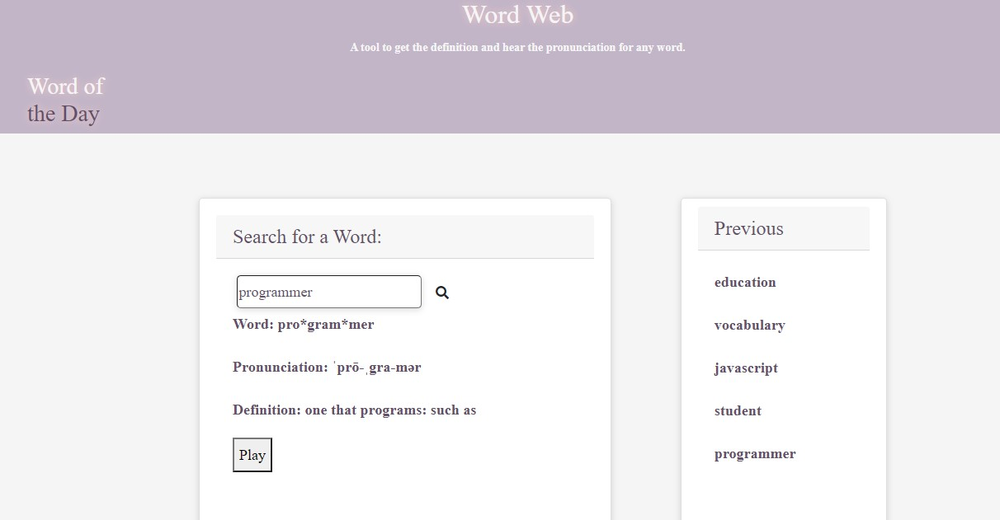

# Word Web
* A dictionary app that allows users to search for a term then returns a definition, pronunciation, and a new word of the day.  This provides more learning than bargained for and for those that are avid learners and looking to “hear the word pronounced correctly”.

## Built With
* HTML 5
* CSS 3
* javaScript 
* jquery 3.4.1
* moment js 2.24
* bootstrap 4.3.1
* font-awesome 5.11.2
* server side api used:
    1. "https://dictionaryapi.com/" - The API that retrieves word and definition data from the input text. This displays on the UI to the USER. 
    2. "https://rapidapi.com/dpventures/api/wordsapi/endpoints" - This is the api used to retrieve the word of the day.

## Website
https://queen-stack.github.io/our_app_project/
 * Access requires internet service.

## Tested on the following browser
Devices and Browsers used:
* Windows 10 (64 bit) - Chrome: 85, Edge(Chromium): 85, Firefox: 80, IE11: 11.5.
* OS X (Beta Big-Sur) (64 bit) - Safari: 14, Chrome: 85, Edge(Chromium): 85, Firefox: 80.
* IE not supported.

## Future Enhancement
* edge bug fix
* translator
* pronunciation of the definition

## Author
* Brian Lopez - [Brian's Portfolio](https://brianslopez.github.io/challenge-02/) - [Brian's git repository](https://github.com/brianslopez) 
* Ann-Marie Orozco - [Ann-Marie's Portfolio](https://ann760.github.io/MyPortfolio/) - [Ann-Marie's git repository](https://github.com/ann760)
* Jenifer Queen - [Jenifer's Portfolio](https://queen-stack.github.io/Challeng2/) - [Jenifer's git repository](https://github.com/queen-stack)
* Michael Dreesen - [Michael's Portfolio](https://mdreesen.github.io/portfolio/) - [Michael's git repository](https://github.com/mdreesen) 